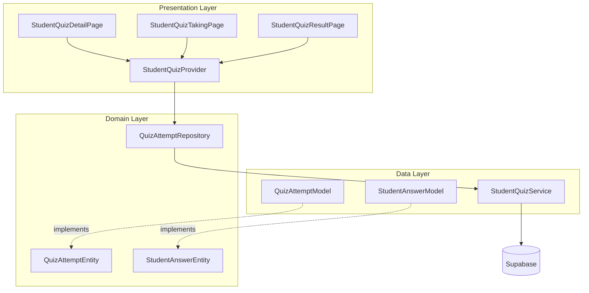

# Design Document: Student Quiz Feature

## Overview

Fitur Student Quiz menyediakan kemampuan bagi siswa untuk mengerjakan kuis yang dibuat oleh mentor. Fitur ini mencakup:

- Halaman detail quiz dengan informasi lengkap dan riwayat attempt
- Dialog konfirmasi sebelum memulai quiz
- Halaman pengerjaan quiz dengan timer countdown dan navigasi soal
- Dialog konfirmasi sebelum submit jawaban
- Halaman hasil quiz dengan indikator warna benar/salah
- Modal ringkasan skor

Arsitektur mengikuti pola Clean Architecture yang sudah ada di project dengan pemisahan layer: domain (entities, repositories), data (models, services), dan presentation (pages, providers, widgets).

## Architecture



## Components and Interfaces

### 1. Domain Layer

#### QuizAttemptEntity

```dart
class QuizAttemptEntity {
  final String id;
  final String quizId;
  final String studentId;
  final DateTime startedAt;
  final DateTime? finishedAt;
  final String status; // 'in_progress' | 'finished'
  final int? score;
  final int answeredCount;
  final int totalQuestions;
  final List<StudentAnswerEntity> answers;
}
```

#### StudentAnswerEntity

```dart
class StudentAnswerEntity {
  final String id;
  final String attemptId;
  final String questionId;
  final String selectedOptionId;
  final bool isCorrect;
}
```

#### QuizAttemptRepository Interface

```dart
abstract class QuizAttemptRepository {
  Future<List<QuizAttemptEntity>> getAttemptsByQuiz(String quizId, String studentId);
  Future<QuizAttemptEntity?> getAttemptById(String attemptId);
  Future<QuizAttemptEntity> startAttempt(String quizId, String studentId);
  Future<QuizAttemptEntity> submitAttempt(String attemptId, List<StudentAnswerEntity> answers);
  Future<int> getAttemptCount(String quizId, String studentId);
}
```

### 2. Data Layer

#### StudentQuizService

```dart
class StudentQuizService {
  Future<List<QuizAttemptModel>> fetchAttemptsByQuiz(String quizId, String studentId);
  Future<QuizAttemptModel?> fetchAttemptById(String attemptId);
  Future<QuizAttemptModel> createAttempt(String quizId, String studentId);
  Future<QuizAttemptModel> submitAttempt(String attemptId, Map<String, String> answers);
  Future<int> calculateScore(String attemptId);
}
```

### 3. Presentation Layer

#### StudentQuizProvider

```dart
class StudentQuizProvider extends ChangeNotifier {
  // State
  QuizModel? currentQuiz;
  QuizAttemptModel? currentAttempt;
  List<QuizAttemptModel> attemptHistory;
  Map<String, String> currentAnswers; // questionId -> optionId
  int remainingSeconds;
  bool isSubmitting;

  // Methods
  Future<void> loadQuizWithAttempts(String quizId);
  Future<void> startQuizAttempt();
  void selectAnswer(String questionId, String optionId);
  Future<void> submitQuizAttempt();
  void startTimer();
  void stopTimer();
  bool canStartQuiz();
  String getStudentStatus();
}
```

#### Pages

- **StudentQuizDetailPage**: Menampilkan detail quiz dan riwayat attempt
- **StudentQuizTakingPage**: Halaman pengerjaan quiz dengan timer
- **StudentQuizResultPage**: Halaman hasil dengan indikator warna

#### Widgets

- **StartQuizDialog**: Dialog konfirmasi mulai quiz
- **SubmitConfirmationDialog**: Dialog konfirmasi submit jawaban
- **QuizTimerWidget**: Widget countdown timer
- **QuestionNavigationGrid**: Grid nomor soal untuk navigasi
- **AnswerOptionWidget**: Widget opsi jawaban dengan state selected
- **AttemptHistoryCard**: Card untuk menampilkan attempt di history
- **ScoreSummaryModal**: Modal ringkasan skor setelah selesai
- **QuestionResultCard**: Card hasil per soal dengan indikator warna

## Data Models

### Database Schema (Supabase)

```sql
-- Quiz Attempts Table
CREATE TABLE quiz_attempts (
  id UUID PRIMARY KEY DEFAULT gen_random_uuid(),
  quiz_id UUID REFERENCES quizzes(id) ON DELETE CASCADE,
  student_id UUID REFERENCES profiles(id) ON DELETE CASCADE,
  started_at TIMESTAMP WITH TIME ZONE DEFAULT NOW(),
  finished_at TIMESTAMP WITH TIME ZONE,
  status VARCHAR(20) DEFAULT 'in_progress', -- 'in_progress', 'finished'
  score INTEGER,
  created_at TIMESTAMP WITH TIME ZONE DEFAULT NOW(),
  updated_at TIMESTAMP WITH TIME ZONE DEFAULT NOW()
);

-- Student Answers Table
CREATE TABLE student_answers (
  id UUID PRIMARY KEY DEFAULT gen_random_uuid(),
  attempt_id UUID REFERENCES quiz_attempts(id) ON DELETE CASCADE,
  question_id UUID REFERENCES questions(id) ON DELETE CASCADE,
  selected_option_id UUID REFERENCES options(id) ON DELETE SET NULL,
  is_correct BOOLEAN,
  created_at TIMESTAMP WITH TIME ZONE DEFAULT NOW()
);

-- Indexes
CREATE INDEX idx_quiz_attempts_quiz_student ON quiz_attempts(quiz_id, student_id);
CREATE INDEX idx_student_answers_attempt ON student_answers(attempt_id);
```

### QuizAttemptModel

```dart
class QuizAttemptModel extends QuizAttemptEntity {
  factory QuizAttemptModel.fromJson(Map<String, dynamic> json);
  Map<String, dynamic> toJson();
}
```

### StudentAnswerModel

```dart
class StudentAnswerModel extends StudentAnswerEntity {
  factory StudentAnswerModel.fromJson(Map<String, dynamic> json);
  Map<String, dynamic> toJson();
}
```

## Correctness Properties

_A property is a characteristic or behavior that should hold true across all valid executions of a system-essentially, a formal statement about what the system should do. Properties serve as the bridge between human-readable specifications and machine-verifiable correctness guarantees._

### Property 1: Score Calculation Correctness

_For any_ set of student answers and quiz questions, the calculated score SHALL equal (number of correct answers / total questions) \* 100, rounded to the nearest integer.

**Validates: Requirements 5.3, 8.3**

### Property 2: Quiz Availability Validation

_For any_ quiz with open_at and close_at dates, and any current timestamp, the quiz SHALL be available for starting if and only if: current_time >= open_at AND current_time <= close_at AND student_attempt_count < max_attempts.

**Validates: Requirements 1.4, 1.5**

### Property 3: Answer State Persistence

_For any_ quiz attempt, selecting an answer for a question and then navigating away and back SHALL preserve the selected answer unchanged.

**Validates: Requirements 4.4, 4.5**

### Property 4: Attempt Record Integrity

_For any_ started quiz attempt, the attempt record SHALL contain: valid student_id, valid quiz_id, started_at timestamp not in the future, and status "in_progress".

**Validates: Requirements 3.3, 8.1**

### Property 5: Submission Data Completeness

_For any_ submitted quiz attempt, the student_answers records SHALL contain exactly one record per question in the quiz, each with valid attempt_id, question_id, and selected_option_id (or null if unanswered).

**Validates: Requirements 5.5, 8.2**

### Property 6: Answer Correctness Determination

_For any_ student answer, is_correct SHALL be true if and only if the selected_option_id matches an option where is_correct is true for that question.

**Validates: Requirements 6.3, 6.4, 8.3**

### Property 7: Attempt History Ordering

_For any_ student-quiz combination with multiple attempts, fetching attempt history SHALL return attempts sorted by started_at in descending order (newest first).

**Validates: Requirements 8.5**

### Property 8: Timer Duration Formatting

_For any_ non-negative integer representing seconds, the timer display SHALL format as "M:SS" where M is minutes and SS is zero-padded seconds.

**Validates: Requirements 4.1**

### Property 9: Answered Count Accuracy

_For any_ quiz attempt state, the answered count displayed SHALL equal the number of questions with non-null selected answers.

**Validates: Requirements 5.1**

### Property 10: Status Display Consistency

_For any_ quiz and student combination, the status SHALL display "Belum mengerjakan" when attempt_count is 0, and "Selesai" when at least one attempt has status "finished".

**Validates: Requirements 1.2, 1.3**

## Error Handling

### Network Errors

- Display snackbar with retry option when API calls fail
- Cache current answers locally to prevent data loss on network failure
- Auto-retry submission up to 3 times before showing error

### Timer Expiry

- Auto-submit answers when timer reaches zero
- Show confirmation that time has expired
- Prevent further answer changes after expiry

### Validation Errors

- Prevent starting quiz if outside date range
- Prevent starting quiz if max attempts reached
- Show clear error messages in Indonesian

### State Recovery

- Persist current answers to local storage during quiz taking
- Recover answers if app is closed unexpectedly
- Handle browser refresh gracefully (web)

## Testing Strategy

### Property-Based Testing Library

Menggunakan **fast_check** package untuk Dart property-based testing.

### Unit Tests

- Test score calculation with various answer combinations
- Test date range validation logic
- Test timer formatting function
- Test answer state management in provider

### Property-Based Tests

Setiap correctness property di atas akan diimplementasikan sebagai property-based test dengan minimal 100 iterasi. Format tag:

```dart
// **Feature: student-quiz-feature, Property {number}: {property_text}**
```

### Integration Tests

- Test full quiz taking flow from start to submit
- Test attempt history display after completion
- Test result page with correct/incorrect indicators

### Widget Tests

- Test dialog displays correct information
- Test timer countdown behavior
- Test question navigation grid state
- Test answer option selection visual feedback
